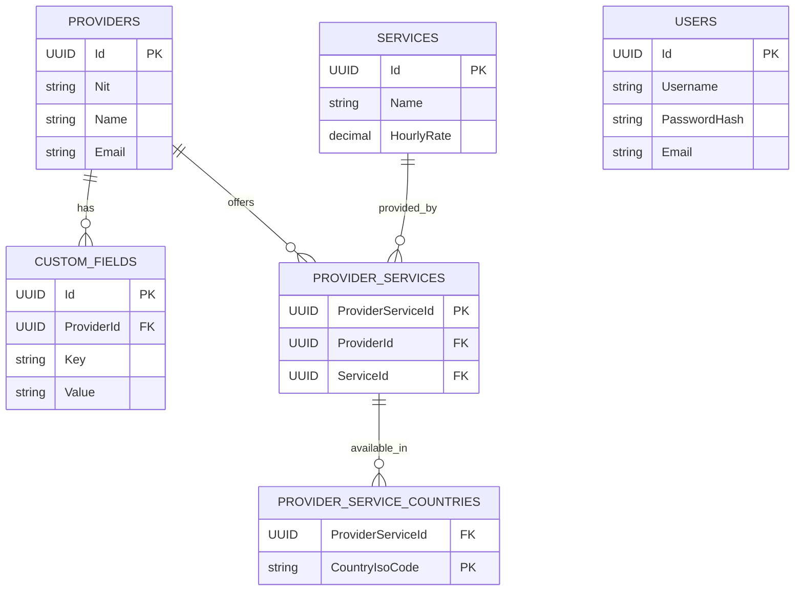

```mermaid
erDiagram
    PROVIDERS {
        UUID Id PK
        string Nit
        string Name
        string Email
    }
    SERVICES {
        UUID Id PK
        string Name
        decimal HourlyRate
    }
    PROVIDER_SERVICES {
        UUID ProviderServiceId PK
        UUID ProviderId FK
        UUID ServiceId FK
    }
    PROVIDER_SERVICE_COUNTRIES {
        UUID ProviderServiceId FK
        string CountryIsoCode PK
    }
    CUSTOM_FIELDS {
        UUID Id PK
        UUID ProviderId FK
        string Key
        string Value
    }
    USERS {
        UUID Id PK
        string Username
        string PasswordHash
        string Email
    }

    PROVIDERS ||--o{ CUSTOM_FIELDS              : has
    PROVIDERS ||--o{ PROVIDER_SERVICES          : offers
    SERVICES  ||--o{ PROVIDER_SERVICES          : provided_by
    PROVIDER_SERVICES ||--o{ PROVIDER_SERVICE_COUNTRIES : available_in
```
